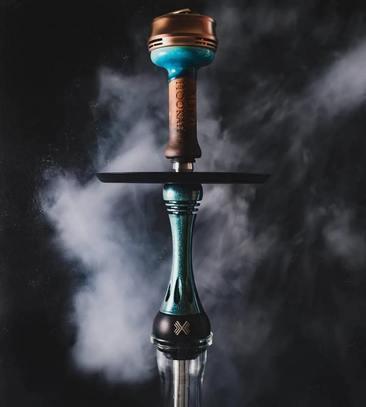
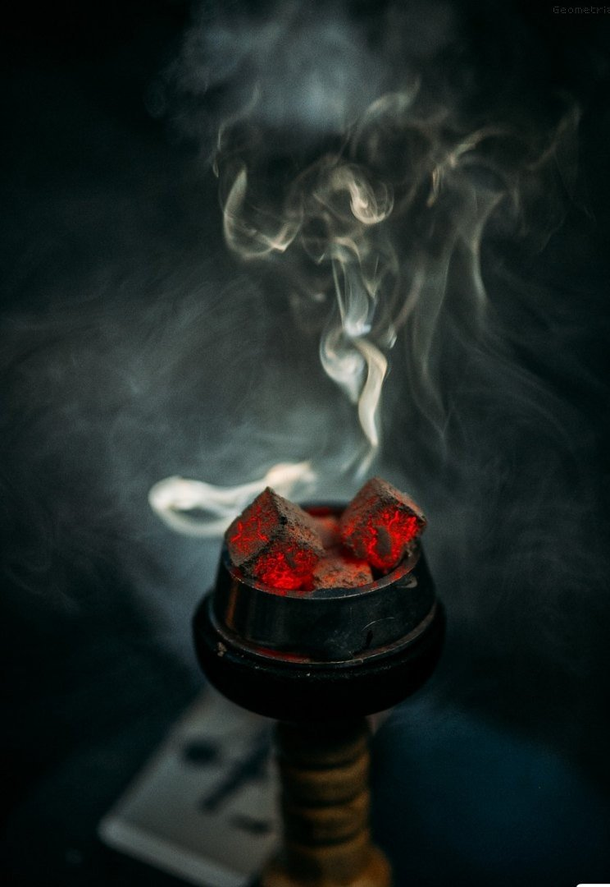
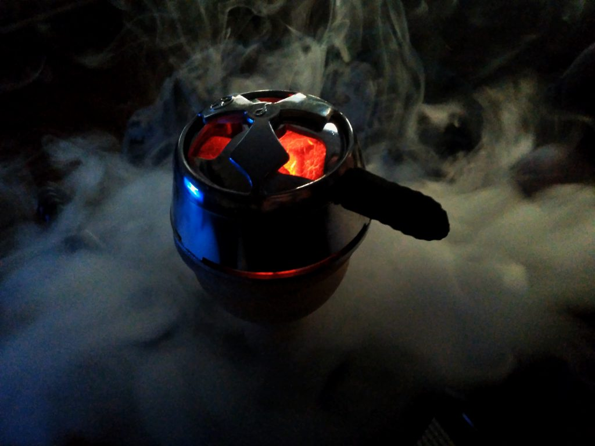
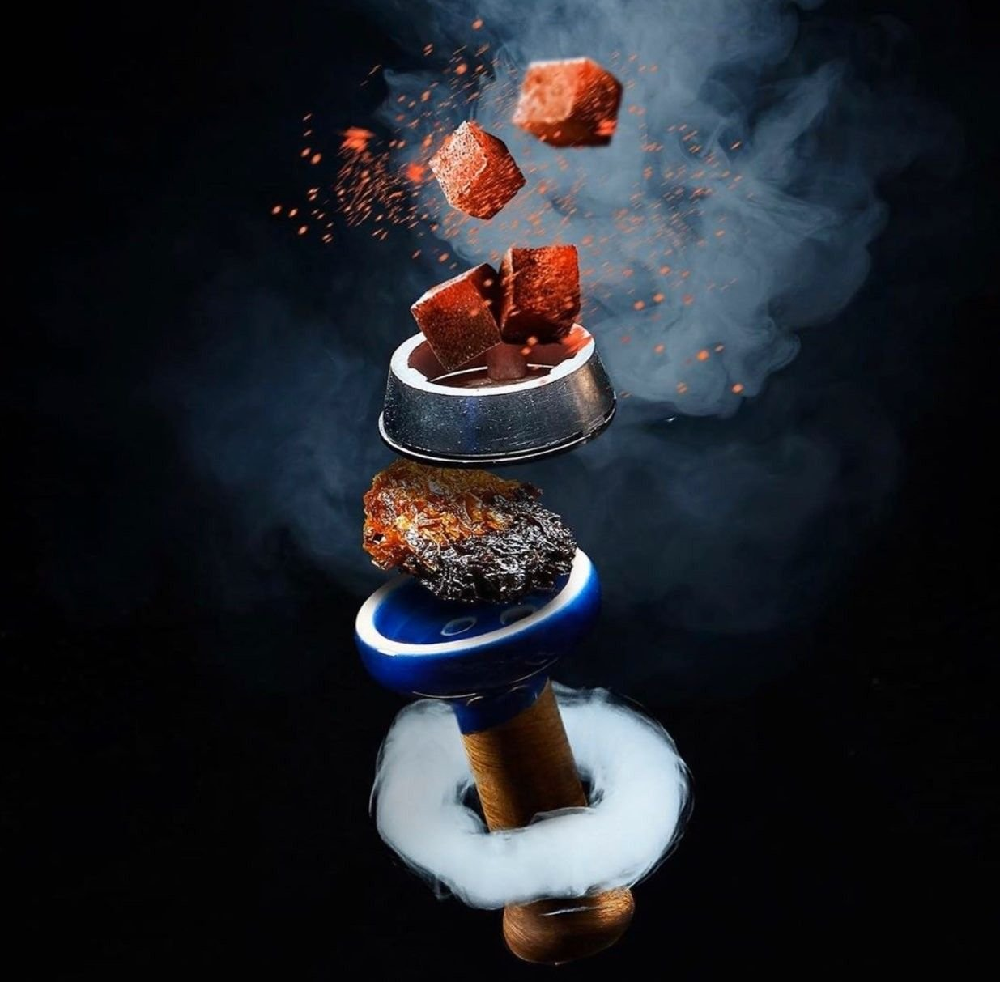

# **Инструкция как забить кальян**

## табаки
 
 1. Крепкие табаки 

    * Tangiers
    * Satyr
    * Darkside
 2. Средняя крепость
    * Must Have
    * Element Вода
    * Darkside Shot
 3. Легкая крепость
    * Adalya
    * Fakher
    * Fumari
## Меню кальяннов

## виды кальянов

## Виды чаш

## **Нам понадобится:**

* Кальян 
* Табак
* Уголь
* Калауд
* Чаша
* Щипцы
* Вода

    ## **Что делаем сначала?**
1. Наливаем воду в колбу кальяна
2. ставим 4 угля 22 размера на плиту
    * либо 3 угля 25 размера
    
3. берем 15-18 грамм табака и забиваем чашу.

    ## **Какие забивки бывают?**

* плотная забивка
* воздушная забивка
* забивка оверкпаком

После всех действий ставь разогретые угли на забитую чашу и ожидаем 7-10 минут

***ПРИЯТНОГО ПОКУРА***

***PS***. **~~КУРЕНИЕ ВРЕДИТ ВАШЕМУ ЗДОРОВЬЮ~~**
